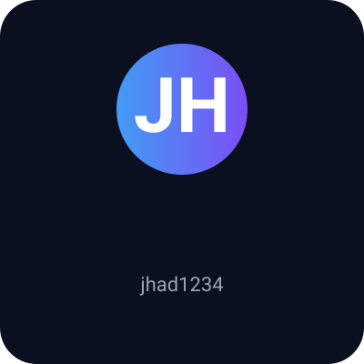

<!-- Header -->

  

<h1 align="center">جهاد — مهندس أنظمة ذكاء اصطناعي ومُهندس حلول (jhad1234)</h1>

---

## 🔎 About Me
أنا جهاد — مهندس أنظمة ذكاء اصطناعي ومهندس حلول تقنية. أعمل على بناء منصات وكلاء ذكاء اصطناعي، أنظمة أتمتة ذكية، وتطوير تطبيقات Android متكاملة مع البُنى السحابية وعمليات DevOps.

**التخصصات:**
- AI Engineer
- AI Agents Developer
- Automation Engineer
- Android Developer
- Cloud & DevOps Engineer

---

## 🛠️ Tech Stack

### AI / ML

### Android

### Backend / Cloud / DevOps

### Databases / Tools

---

## ⭐ Featured Projects
| المشروع | وصف قصير | تقنيات |
| --- | --- | --- |
| [AI-Android-Dev-System](https://github.com/jhad1234/AI-Android-Dev-System) | نظام وكلاء ذكي لإدارة أجهزة Android وآلية الصيانة. | Kotlin, Android, AI Agents |
| [python-ai-agents](https://github.com/jhad1234/python-ai-agents) | مكتبة لبناء وكلاء ذكاء اصطناعي قابلة للتوسعة والتكامل مع APIs. | Python, OpenAI |
| [General-AI-Agent](https://github.com/jhad1234/General-AI-Agent) | إطار عمل لوكلاء عامين لإدارة المهام والأتمتة. | Automation, Agents, ML |

---

## 📈 GitHub Analytics
<!--START_SECTION:github_stats-->
<!-- Content updated by automation workflow -->
<!--END_SECTION:github_stats-->

  
   
  
   
  
   
  

---

## 📊 Activity & Contributions

  

---

## ✉️ Contact

  
  

---

يرجى تشغيل workflow "Generate Snake" إذا لم تظهر خريطة المساهمات.
